# Grid–Data Center Co-simulation Architecture: Rendered Views

[Read the full architecture](grid-dc-simulation-architecture.md) · [Download the seven-page PDF](grid-dc-simulation-architecture-visualization.pdf)

The images below are scalable SVGs. Select an image or its **Open full size** link to inspect detailed labels.

## 1. Simplified Grid–DC overview

This is the recommended starting view. It expands the original meeting diagram while retaining its workload → data-centre ← energy-system structure.

[Open full size](diagrams/rendered/grid-dc-overview.svg) · [Download one-page PDF](grid-dc-overview.pdf) · [Mermaid source](diagrams/grid-dc-overview.mmd)

## 2. System context

People, external data and simulation systems, and the Grid–DC co-simulation platform boundary.

[Open full size](diagrams/rendered/system-context.svg)

## 3. Container view

The platform's major simulation, coordination, contract, storage, and analysis containers.

[Open full size](diagrams/rendered/container.svg)

## 4. Orchestration and time-coordination components

Multi-rate scheduling, event ordering, coupling, transport, lifecycle, checkpoints, and provenance.

[Open full size](diagrams/rendered/coordination-components.svg)

## 5. Data-center components

Workload execution, IT power and heat, facility electrical distribution, UPS/BESS, protection, cooling, thermal state, and controls.

[Open full size](diagrams/rendered/data-center-components.svg)

## 6. Grid components

Grid initialization, network equations, dynamic devices, disturbances, controls, protection, PCC observation, and metrics.

[Open full size](diagrams/rendered/grid-components.svg)

## 7. Physical-domain view

Electrical-power paths, compute and thermal flows, and the measurement/control overlay. This is intentionally separate from the C4 software views.

[Open full size](diagrams/rendered/physical-domain.svg)

