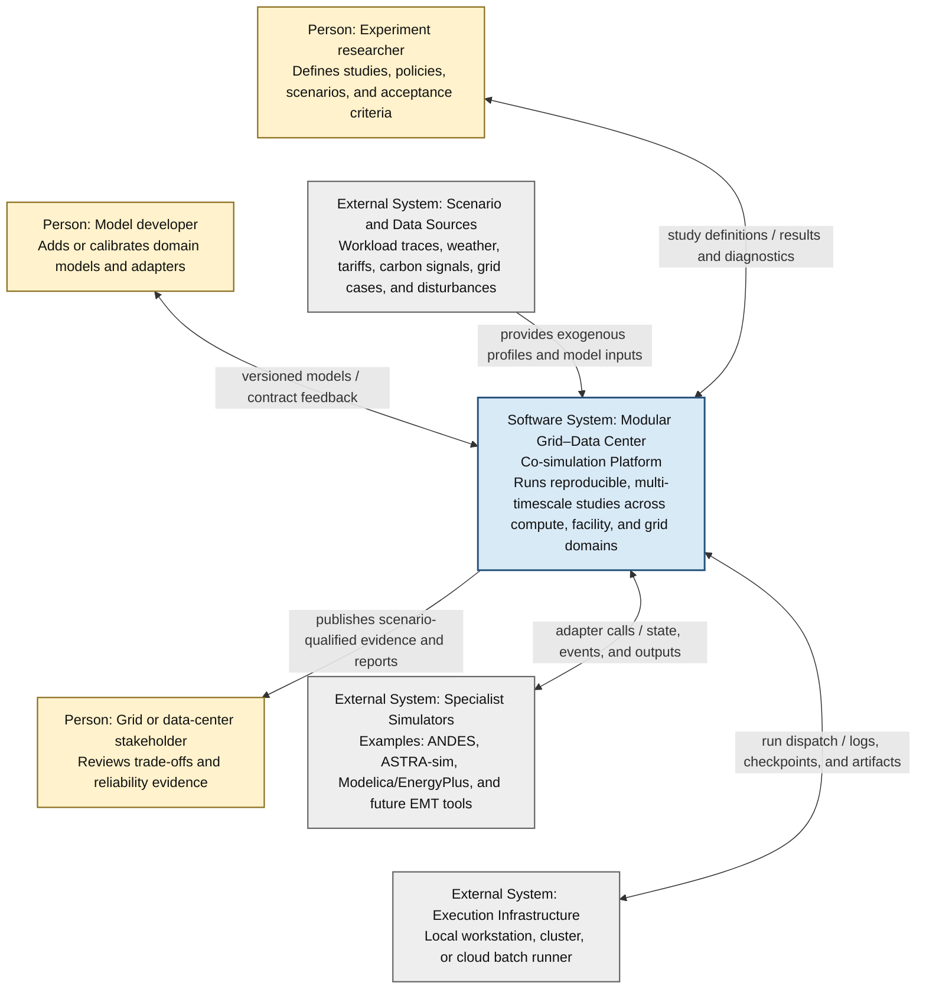
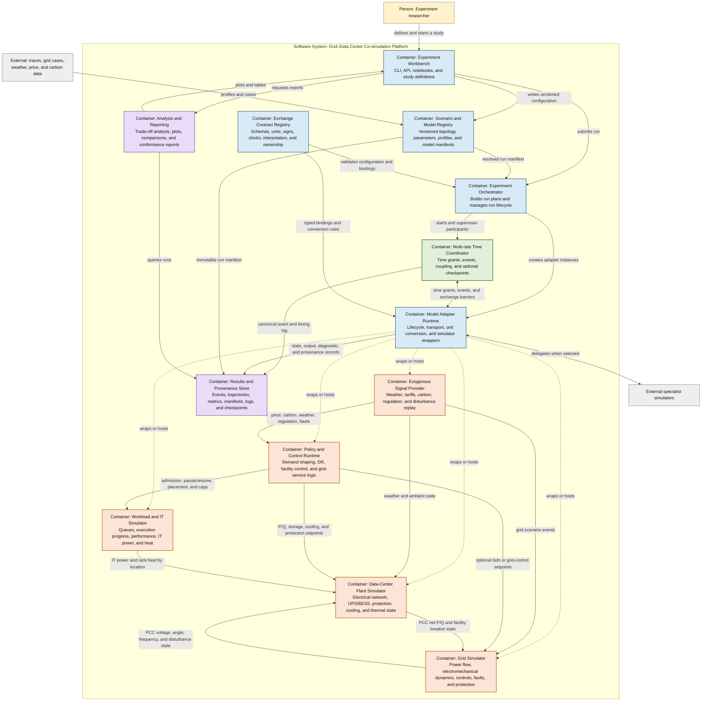

# Modular Grid–Data Center Co-simulation Architecture

**Status:** proposed logical architecture, version 0.1 
**Purpose:** establish a literature-backed, implementation-neutral structure for a modular Grid–Data Center (Grid–DC) co-simulation platform. 
**First vertical slice:** demand shaping in response to price or carbon intensity. This is an example study, not the platform's global objective.

**Rendered views:** [simplified overview](diagrams/rendered/grid-dc-overview.svg) · [visual gallery](grid-dc-simulation-architecture-visualization.md) · [seven-page PDF](grid-dc-simulation-architecture-visualization.pdf)

## Contents

1. [Executive summary](#1-executive-summary)
2. [Scope and boundaries](#2-scope-and-boundaries)
3. [Architecture drivers and evidence](#3-architecture-drivers-and-evidence)
4. [C4 System Context](#4-c4-system-context)
5. [C4 Container view](#5-c4-container-view)
6. [C4 Component view: orchestration and time coordination](#6-c4-component-view-orchestration-and-time-coordination)
7. [C4 Component view: data center](#7-c4-component-view-data-center)
8. [C4 Component view: grid](#8-c4-component-view-grid)
9. [Physical-domain view](#9-physical-domain-view)
10. [Exchange contracts and interface catalogue](#10-exchange-contracts-and-interface-catalogue)
11. [Variable taxonomy and ownership](#11-variable-taxonomy-and-ownership)
12. [Multi-rate time model](#12-multi-rate-time-model)
13. [Study and fidelity profiles](#13-study-and-fidelity-profiles)
14. [Unresolved architecture decisions](#14-unresolved-architecture-decisions)
15. [Experiment lifecycle and reproducibility](#15-experiment-lifecycle-and-reproducibility)
16. [Verification, validation, and uncertainty](#16-verification-validation-and-uncertainty)
17. [Literature-to-architecture traceability](#17-literature-to-architecture-traceability)
18. [Limitations of this architecture baseline](#18-limitations-of-this-architecture-baseline)
19. [References](#19-references)

## 1. Executive summary

The platform must represent one closed causal loop:

> synchronized workload activity → IT power and heat → facility electrical and cooling demand → point-of-common-coupling (PCC) active/reactive power → grid voltage and frequency → protection and control action → changed workload, storage, and cooling behavior.

This loop matters because a large AI campus is not a collection of independent small loads. Synchronized jobs can produce correlated ramps and oscillations, which weakens the load-diversity assumption used in traditional grid planning. During a disturbance, UPS and protection behavior can also remove a large block of load at once and amplify the original grid event [R1, R5, R14].

The architecture therefore makes the following decisions:

1. **Use C4 only for software structure.** Represent the physical grid, electrical plant, compute equipment, and heat paths in a separate domain diagram.
2. **Use multiple clocks.** Millisecond LVRT studies, 2-second regulation, minute/hour scheduling and thermal studies, and multi-year planning cannot share one useful global step.
3. **Make exchange contracts first-class.** Every important value has a named owner, direction, unit, sign convention, time semantics, validity, and interpolation rule.
4. **Keep domain fidelity replaceable.** A profile model and ASTRA-sim can implement the same IT-facing contract; a lumped thermal model and a Modelica model can implement the same thermal-facing contract.
5. **Treat discontinuities as events.** Breaker trips, fault application/clearing, job start/stop, and protection transfer must not be hidden by time averaging.
6. **Record claims at the correct evidence level.** A successful simulation is evidence about the selected models and scenarios. It is not physical validation, a grid-code certificate, or permission to deploy a controller.

The logical architecture does **not** yet select HELICS, FMI, a custom coordinator, an RMS or EMT grid boundary, or a particular thermal and workload fidelity. Those decisions are listed in [Section 14](#14-unresolved-architecture-decisions).

## 2. Scope and boundaries

### 2.1 In scope

- Workload arrival, queueing, placement, execution progress, QoS, and IT power/heat.
- Internal data-center electrical distribution, UPS/BESS, on-site generation, protection, cooling, and thermal state.
- Grid steady-state and dynamic behavior, disturbances, protection, and the PCC coupling.
- Exogenous weather, price, carbon, regulation, workload, and disturbance profiles.
- Control policies that act on workload, power caps, storage, reactive power, cooling, and grid-service participation.
- Multi-rate orchestration, adapters, contract validation, provenance, repeatability, and analysis.
- Fidelity profiles for operational, LVRT, demand-response, and planning studies.

### 2.2 Out of scope for the initial platform baseline

- A single optimizer that defines what every experiment should optimize.
- Vendor-certified UPS, relay, server, or cooling-plant behavior.
- Regulatory compliance certification or a construction recommendation.
- A real-time production controller or hardware-in-the-loop deployment.
- Automatic conversion between arbitrary models without an explicit semantic adapter.
- Running a years-long planning model at an electrical-transient time step.

### 2.3 Architectural status labels

| Label | Meaning |
|---|---|
| **Accepted** | Part of this logical baseline. An implementation should preserve it. |
| **Proposed baseline** | A concrete starting point that must be checked with convergence, calibration, or reproduction tests. |
| **Unresolved U-nn** | A decision that affects results or implementation and must remain visible until evidence closes it. |
| **Study-specific** | Selected per experiment rather than fixed platform-wide. |

## 3. Architecture drivers and evidence

| Driver | Architectural consequence | Evidence |
|---|---|---|
| AI jobs can synchronize a geographically concentrated load and create second-to-millisecond ramps. | Preserve workload phase changes and aggregate them explicitly instead of assuming independent node demand. | Bashir et al. describe the loss of load diversity and call for accelerator-trace-to-grid simulation [R1]. |
| Data-center disconnection can aggravate a grid disturbance. | Model facility protection, UPS transfer, breaker state, and net P/Q as part of the feedback loop. | Xie et al. couple transmission dynamics to an internal data-center network and show voltage/protection effects [R5]; the 2024 event motivates this concern [R14]. |
| Relevant dynamics span many orders of magnitude. | Use multi-rate scheduling, events, and study profiles rather than one global time step. | The literature covers 5 ms LVRT control updates [R5], 2 s regulation signals [R2], hour-scale carbon shifting [R10], and multi-year planning [R1, R4]. |
| Domain tools have different internal representations. | Put a typed adapter and contract boundary around each simulator. | ASTRA-sim separates workload, system, and network layers and uses portable representations [R3]; FMI and HELICS provide established interoperability mechanisms [R7, R8]. |
| Static facility design and dynamic operation are different concerns. | Use configuration generators to create model inputs, not as substitutes for operational simulators. | DCGen states that it generates JSON-encoded configurations rather than simulating operation [R4]. |
| IT power, cooling, and thermal dynamics are coupled but need different fidelity by study. | Keep IT power, heat release, thermal state, and cooling power as separate components and contracts. | The data-center power-model survey separates major contributors [R12]; dynamic Modelica cooling studies support component-level thermal/control modeling [R11]. |
| High-fidelity simulation does not imply real-world validation. | Record model versions, assumptions, calibration domain, and uncertainty with each result. | Phythesis explicitly depends on its simulator boundaries and uses parameterized component abstractions rather than full thermodynamics [R6]. |

## 4. C4 System Context

This is a software context view. Grid buses, UPS devices, racks, and cooling loops are intentionally absent; they appear in the physical-domain view.

Source: [`diagrams/system-context.mmd`](diagrams/system-context.mmd)

### 4.1 Actors and external systems

- The **experiment researcher** defines the question, admissible controls, fidelity profile, scenario set, metrics, and acceptance criteria.
- The **model developer** owns model implementation, calibration range, adapter behavior, and contract conformance.
- A **grid or data-center stakeholder** consumes scenario-qualified results but does not receive a deployment claim.
- **Scenario and data sources** remain external because their ownership, update rate, licensing, and uncertainty differ from the platform.
- **Specialist simulators** remain independently replaceable. The platform owns their integration contract, not their internal solver.
- **Execution infrastructure** supplies compute and isolation. It does not define simulation time.

## 5. C4 Container view

The containers are logical deployable or independently runnable units. A small implementation can place several containers in one process, but it must preserve their contracts and ownership.

Source: [`diagrams/container.mmd`](diagrams/container.mmd)

Direct arrows between domain containers show logical, typed exchanges. The Model Adapter Runtime and Time Coordinator carry and order those exchanges in an implementation; the arrows do not authorize an unversioned point-to-point API.

### 5.1 Container responsibilities

| Container | Owns | Must not silently own |
|---|---|---|
| Experiment Workbench | User-facing study definition, launch, and report requests. | Domain equations or hidden defaults. |
| Scenario and Model Registry | Immutable model/profile versions, topology, parameters, and resolved manifests. | Runtime state. |
| Experiment Orchestrator | Run lifecycle, participant selection, failure policy, and study profile. | Numerical time inside a domain solver. |
| Exchange Contract Registry | Variable semantics, units, signs, clocks, quality, interpolation, and compatibility rules. | Transport-specific names as the only source of meaning. |
| Multi-rate Time Coordinator | Logical time, grants, events, barriers, and coupling iterations. | Physical behavior that belongs in a model. |
| Model Adapter Runtime | Lifecycle mapping, serialization, conversion, capability discovery, and wrapper processes. | Undocumented corrections to domain outputs. |
| Policy and Control Runtime | Study-selected decision logic and control state. | The physical response to a command. |
| Workload and IT Simulator | Work arrival, execution progress, resource state, performance, IT power, and heat. | Facility losses or grid voltage. |
| Data-Center Plant Simulator | Internal electrical/thermal state, cooling, storage, protection, and PCC aggregation. | Upstream transmission dynamics. |
| Grid Simulator | Network and device dynamics, disturbances, grid protection/control, and PCC conditions. | Internal facility topology unless explicitly included in its model boundary. |
| Exogenous Signal Provider | Replay and forecast semantics for inputs not solved inside the run. | Causal feedback falsely presented as an external trace. |
| Results and Provenance Store | Canonical observations, events, diagnostics, manifests, model hashes, and checkpoints. | Mutable scenario truth. |
| Analysis and Reporting | Derived metrics, trade-offs, comparisons, and conformance reports. | Changes to the completed run record. |

### 5.2 Replaceability rule

A model replacement is valid only when it declares the same contract semantics or supplies an explicit adapter. Matching field names is insufficient. For example:

- ASTRA-sim can improve workload execution and communication timing, but it does not automatically supply a calibrated facility-power model. Its adapter must still produce the required IT power and heat outputs [R3].
- DCGen can initialize rack, electrical, cooling, and redundancy structure, but another model must simulate their operational dynamics [R4].
- An EMT model and an RMS phasor model cannot be exchanged merely by matching `voltage`; waveform, phasor, frequency, and averaging semantics differ.

## 6. C4 Component view: orchestration and time coordination

Source: [`diagrams/coordination-components.mmd`](diagrams/coordination-components.mmd)

```mermaid
flowchart LR
    workbench["Container: Experiment Workbench"]
    registry["Container: Scenario, Model,<br/>and Contract Registries"]
    participants["Domain adapters and<br/>simulation participants"]
    store["Results and Provenance Store"]

    subgraph coordinator["Container: Experiment Orchestrator and Multi-rate Time Coordinator"]
        compiler["Component: Scenario Compiler<br/>Resolves versions, dependencies, clocks, and study profile"]
        lifecycle["Component: Lifecycle Manager<br/>Instantiate, initialize, run, stop, and clean up"]
        validator["Component: Contract Validator<br/>Checks schema, units, sign, range, ownership, and clock compatibility"]
        scheduler["Component: Multi-rate Scheduler<br/>Computes safe grants from requested times and next events"]
        eventQueue["Component: Superdense Event Queue<br/>Orders simultaneous discrete events without inventing elapsed time"]
        coupling["Component: Coupling Manager<br/>Resolves PCC and other feedback loops at communication points"]
        checkpoint["Component: State and Checkpoint Manager<br/>Snapshots participants when their capabilities permit"]
        transport["Component: Transport Gateway<br/>Maps logical exchanges to HELICS, FMI, IPC, or process calls"]
        supervisor["Component: Run Supervisor<br/>Timeouts, non-convergence, participant failure, and deterministic abort"]
        recorder["Component: Provenance Recorder<br/>Records grants, events, conversions, iterations, and model hashes"]
    end

    workbench -->|"experiment specification"| compiler
    registry -->|"models, profiles, and contracts"| compiler
    compiler -->|"validated run plan"| lifecycle
    compiler -->|"bindings"| validator
    lifecycle -->|"participant lifecycle calls"| transport

    participants -->|"time request and next-event time"| transport
    transport -->|"candidate messages"| validator
    validator -->|"valid timestamped values and events"| eventQueue
    eventQueue -->|"next ordered event"| scheduler
    scheduler -->|"time grant"| transport
    transport -->|"grant, inputs, and control events"| participants

    transport -->|"coupled outputs"| coupling
    coupling -->|"iterate, accept, or reject step"| scheduler
    coupling -->|"updated boundary values"| transport
    checkpoint <-->|"save or restore state"| transport
    scheduler -->|"checkpoint boundary"| checkpoint

    supervisor -->|"health and stop decisions"| lifecycle
    transport -->|"health and errors"| supervisor
    validator --> recorder
    scheduler --> recorder
    eventQueue --> recorder
    coupling --> recorder
    lifecycle --> recorder
    recorder -->|"canonical run record"| store

    u01["UNRESOLVED U-01<br/>HELICS, FMI 3.0, hybrid, or custom transport"]
    u02["UNRESOLVED U-02<br/>Conservative synchronization or rollback"]
    u08["UNRESOLVED U-08<br/>Lagged, Jacobi, Gauss-Seidel, or iterative PCC coupling"]
    u01 -.-> transport
    u02 -.-> scheduler
    u02 -.-> checkpoint
    u08 -.-> coupling

    classDef external fill:#eeeeee,stroke:#666,color:#111;
    classDef component fill:#d9eaf7,stroke:#24527a,color:#111,stroke-width:1.5px;
    classDef critical fill:#e2f0d9,stroke:#3c763d,color:#111,stroke-width:2px;
    classDef decision fill:#fff2cc,stroke:#bf9000,color:#111,stroke-width:2px,stroke-dasharray:5 3;
    class workbench,registry,participants,store external;
    class compiler,lifecycle,validator,eventQueue,checkpoint,transport,supervisor,recorder component;
    class scheduler,coupling critical;
    class u01,u02,u08 decision;
```

### 6.1 Required coordination behavior

1. Compile the experiment into an immutable run manifest before initialization.
2. Reject incompatible units, clock domains, causality, and unsupported checkpoint requirements before the run where possible.
3. Initialize each physical model to a mutually consistent operating point. A converged grid power flow alone is not sufficient if facility P/Q or storage state disagrees.
4. Advance participants only to a granted logical time. A participant can use smaller internal solver steps.
5. Stop at the earliest scheduled or state-triggered event that a participant exposes.
6. Process all events at one physical time with ordered microsteps. This prevents a breaker trip and its consequences from being assigned artificial elapsed time.
7. Resolve feedback at communication points using the selected coupling rule. Record iteration count, residual, tolerance, and whether the value was accepted with lag.
8. Commit outputs and checkpoints only after the step is accepted.
9. Abort deterministically on contract violation or non-convergence unless the scenario names a different policy.

FMI 3.0 supplies clocks, event mode, early return, intermediate updates, and optional state serialization that can support parts of this behavior [R8]. HELICS supplies a scalable federated co-simulation and time-coordination framework [R7]. Their roles overlap but are not identical; selection remains unresolved.

## 7. C4 Component view: data center

Source: [`diagrams/data-center-components.mmd`](diagrams/data-center-components.mmd)

```mermaid
flowchart LR
    workloadSource["Workload traces or arrivals"]
    policy["Policy and Control Runtime"]
    grid["Grid Simulator at PCC"]
    ambient["Weather and ambient profiles"]
    coordinator["Multi-rate Time Coordinator"]

    subgraph dc["Container: Data-Center Plant and Workload Simulation"]
        adapter["Component: Data-Center Adapter<br/>Contracts, time, units, and state serialization"]

        intake["Component: Workload Intake<br/>Jobs, DAGs, release times, deadlines, and QoS classes"]
        scheduler["Component: Scheduler and Admission Control<br/>Queue, place, pause, resume, migrate, or reject"]
        execution["Component: Replaceable Execution Model<br/>Trace/profile model or high-fidelity IT simulator"]
        itPower["Component: IT Power and Heat Model<br/>Node/rack utilization to electrical power and heat release"]

        controller["Component: Facility Control Gateway<br/>Coordinates scheduler, power caps, storage, cooling, and local voltage control"]
        flexibility["Component: Flexibility Estimator<br/>Feasible up/down power, ramp, duration, and recovery limits"]

        pcc["Component: PCC Interface<br/>Root-bus state, net P/Q, losses, and connection status"]
        electrical["Component: Internal Electrical Network<br/>Transformers, switchgear, buses, PDUs, and power flow"]
        protection["Component: Protection and Transfer Logic<br/>Voltage-time timers, latches, transfer, trip, and reconnect"]
        storage["Component: UPS/BESS and Inverter Models<br/>P/Q limits, efficiency, state of charge, and mode"]
        onsite["Component: On-site Generation<br/>Start delay, ramp, fuel, minimum loading, and availability"]

        thermal["Component: Replaceable Thermal Model<br/>Lumped zones, Modelica/EnergyPlus, or CFD-derived surrogate"]
        cooling["Component: Cooling Plant and Controls<br/>Fans, pumps, chillers, economizers, and thermal storage"]

        telemetry["Component: State and Metrics Aggregator<br/>Performance, QoS, energy, temperature, trips, and constraints"]
    end

    coordinator <-->|"time grants, events, and checkpoints"| adapter
    adapter -->|"timestamped workload events"| intake
    workloadSource -->|"job and trace data"| adapter
    intake --> scheduler
    scheduler -->|"active jobs, placement, and caps"| execution
    execution -->|"progress, utilization, and communication phases"| itPower
    itPower -->|"rack IT power"| electrical
    itPower -->|"heat by rack or zone"| thermal

    ambient -->|"dry/wet-bulb temperature and humidity"| adapter
    adapter -->|"ambient boundary conditions"| thermal
    thermal -->|"zone and coolant temperatures; cooling demand"| cooling
    cooling -->|"cooling electrical P/Q"| electrical
    cooling -->|"removed heat and coolant/air flow"| thermal

    grid -->|"PCC voltage magnitude/angle, frequency, disturbance, grid breaker"| adapter
    adapter --> pcc
    pcc -->|"root voltage and connection state"| electrical
    electrical -->|"net measured import P/Q and losses"| pcc
    pcc -->|"net P/Q and facility breaker state"| adapter
    adapter -->|"PCC response"| grid

    electrical -->|"internal voltage and loading"| protection
    protection -->|"transfer, trip, reconnect, and load status"| electrical
    storage -->|"inverter P/Q"| electrical
    onsite -->|"generated P/Q"| electrical

    policy -->|"objectives, targets, and high-level controls"| adapter
    adapter --> controller
    electrical -->|"voltage, loading, and breaker telemetry"| controller
    protection -->|"timers and availability"| controller
    storage -->|"state of charge and capability"| controller
    thermal -->|"temperature and headroom"| controller
    execution -->|"queue, progress, and QoS risk"| controller
    controller -->|"admit, pause/resume, placement"| scheduler
    controller -->|"DVFS or device power caps"| itPower
    controller -->|"P/Q and mode setpoints"| storage
    controller -->|"start/stop and P setpoints"| onsite
    controller -->|"setpoints and thermal limits"| cooling
    controller -->|"permitted protection and reconnect settings"| protection

    scheduler --> telemetry
    execution --> telemetry
    electrical --> telemetry
    protection --> telemetry
    storage --> telemetry
    thermal --> telemetry
    cooling --> telemetry
    telemetry --> flexibility
    flexibility --> controller
    telemetry -->|"states, metrics, and diagnostics"| adapter

    u05["UNRESOLVED U-05<br/>Trace/profile execution or ASTRA-sim fidelity"]
    u06["UNRESOLVED U-06<br/>Lumped thermal, Modelica/EnergyPlus, or CFD surrogate"]
    u09["UNRESOLVED U-09<br/>Duty-window gating or fluid run-fraction approximation"]
    u05 -.-> execution
    u06 -.-> thermal
    u09 -.-> scheduler

    classDef external fill:#eeeeee,stroke:#666,color:#111;
    classDef adapterStyle fill:#e2f0d9,stroke:#3c763d,color:#111,stroke-width:2px;
    classDef compute fill:#d9eaf7,stroke:#24527a,color:#111,stroke-width:1.5px;
    classDef electricalStyle fill:#fce4d6,stroke:#a64b00,color:#111,stroke-width:1.5px;
    classDef thermalStyle fill:#eadcf8,stroke:#674ea7,color:#111,stroke-width:1.5px;
    classDef controlStyle fill:#d9ead3,stroke:#38761d,color:#111,stroke-width:1.5px;
    classDef decision fill:#fff2cc,stroke:#bf9000,color:#111,stroke-width:2px,stroke-dasharray:5 3;
    class workloadSource,policy,grid,ambient,coordinator external;
    class adapter adapterStyle;
    class intake,scheduler,execution,itPower compute;
    class pcc,electrical,protection,storage,onsite electricalStyle;
    class thermal,cooling thermalStyle;
    class controller,flexibility,telemetry controlStyle;
    class u05,u06,u09 decision;
```

### 7.1 Important data-center boundaries

- **Execution and power are separate.** Execution state produces utilization and phase information. A calibrated power model converts that information to electrical demand. This avoids assuming that more detailed network timing is automatically more accurate power modeling.
- **Power and heat are separate outputs.** IT electrical power becomes heat subject to modeled storage, losses, and location. The thermal model must not infer rack placement from an unlabeled facility total.
- **Cooling is both a load and a controller.** It draws electrical P/Q, changes thermal state, and can provide limited flexibility subject to temperatures, flows, and recovery effects.
- **UPS is both protection and a controllable inverter.** Its protection thresholds, transfer state, energy state, and optional grid-interactive P/Q control must remain distinct. Treating a UPS only as an ideal battery misses the disturbance-amplification path [R5].
- **PCC power includes the whole facility.** Net P/Q includes IT, cooling, conversion losses, auxiliary loads, storage charge/discharge, and on-site generation inside the selected meter boundary.
- **Flexibility is a feasible envelope, not a scalar.** It depends on time, ramp, duration, state of charge, thermal headroom, job constraints, and rebound/recovery obligations.

### 7.2 Data-center invariants

At each accepted exchange point, the implementation should check:

1. Net PCC active power equals modeled facility consumption plus losses and storage charging, minus on-site generation and storage discharge, within a declared residual tolerance.
2. Storage state of charge changes consistently with terminal power, efficiency, elapsed time, and limits.
3. Heat entering thermal zones is consistent with the selected IT heat mapping and non-IT gains.
4. A disconnected branch or open facility breaker cannot continue to import grid power.
5. A tripped or unavailable resource cannot accept a control setpoint.
6. Queue progress cannot exceed admitted execution and cannot decrease except through an explicitly modeled restart or lost-work event.

## 8. C4 Component view: grid

Source: [`diagrams/grid-components.mmd`](diagrams/grid-components.mmd)

```mermaid
flowchart LR
    scenario["Grid cases, forecasts, and disturbance scenarios"]
    dc["Data-Center Simulator at PCC"]
    policy["Policy and Control Runtime"]
    coordinator["Multi-rate Time Coordinator"]

    subgraph grid["Container: Grid Simulator"]
        adapter["Component: Grid Adapter<br/>Contracts, time, units, sign conversion, and state serialization"]
        initializer["Component: Case Loader and Initializer<br/>Topology, parameters, dispatch, power flow, and consistent initial state"]
        network["Component: Network Algebraic Model<br/>Bus voltages, angles, branch flows, and network constraints"]
        dynamics["Component: Dynamic Device Models and Solver<br/>Generators, inverters, motors, governors, exciters, and DAEs"]
        loads["Component: Other Load and DER Models<br/>Static, voltage/frequency-sensitive, composite, and distributed resources"]
        pccLoad["Component: Data-Center PCC Load Interface<br/>Applies net P/Q and discrete connection state at the selected bus"]
        events["Component: Disturbance Engine<br/>Faults, clearing, line/generator trips, and parameter changes"]
        protection["Component: Grid Protection and Switching<br/>Relays, timers, breakers, load shedding, and reconnection"]
        controls["Component: Grid Controls<br/>Primary response, AVR/PSS, AGC, dispatch, and optional voltage control"]
        observer["Component: PCC Observer<br/>Voltage magnitude/angle, frequency estimate, disturbance, and quality flags"]
        metrics["Component: Grid Metrics<br/>Nadir, RoCoF, voltage envelope, flows, stability, unserved energy, and violations"]
    end

    coordinator <-->|"time grants, events, and checkpoints"| adapter
    scenario -->|"case and event definitions"| adapter
    adapter --> initializer
    initializer -->|"consistent operating point"| network
    initializer -->|"initialized dynamic state"| dynamics
    initializer -->|"load and DER state"| loads

    dc -->|"net active/reactive import and facility breaker"| adapter
    adapter --> pccLoad
    pccLoad -->|"signed bus injection and status"| network
    loads -->|"other bus injections"| network
    dynamics <-->|"state derivatives, residuals, and algebraic variables"| network

    events -->|"fault admittance and topology events"| network
    events -->|"device trip or parameter events"| dynamics
    network -->|"voltage/current measurements"| protection
    dynamics -->|"frequency and device state"| protection
    protection -->|"breaker and shedding events"| network
    protection -->|"device status changes"| dynamics

    network -->|"voltage and flow feedback"| controls
    dynamics -->|"frequency and machine feedback"| controls
    policy -->|"optional reserve, dispatch, or voltage targets"| adapter
    adapter --> controls
    controls -->|"device references"| dynamics

    network --> observer
    dynamics --> observer
    events --> observer
    protection --> observer
    observer -->|"PCC state with quality and validity"| adapter
    adapter -->|"voltage, angle, frequency, disturbance, grid breaker"| dc

    network --> metrics
    dynamics --> metrics
    protection --> metrics
    observer --> metrics
    metrics -->|"states, metrics, and diagnostics"| adapter

    u03["UNRESOLVED U-03<br/>RMS phasor dynamics or EMT coupling"]
    u04["UNRESOLVED U-04<br/>Transmission only or transmission plus utility distribution"]
    u03 -.-> dynamics
    u03 -.-> network
    u04 -.-> initializer
    u04 -.-> network

    classDef external fill:#eeeeee,stroke:#666,color:#111;
    classDef adapterStyle fill:#e2f0d9,stroke:#3c763d,color:#111,stroke-width:2px;
    classDef component fill:#d9eaf7,stroke:#24527a,color:#111,stroke-width:1.5px;
    classDef physical fill:#fce4d6,stroke:#a64b00,color:#111,stroke-width:1.5px;
    classDef controlStyle fill:#d9ead3,stroke:#38761d,color:#111,stroke-width:1.5px;
    classDef decision fill:#fff2cc,stroke:#bf9000,color:#111,stroke-width:2px,stroke-dasharray:5 3;
    class scenario,dc,policy,coordinator external;
    class adapter adapterStyle;
    class initializer,events,observer,metrics component;
    class network,dynamics,loads,pccLoad physical;
    class protection,controls controlStyle;
    class u03,u04 decision;
```

### 8.1 Important grid boundaries

- The **PCC load interface** owns conversion between the facility convention, where positive P/Q means import, and a grid solver that may define positive values as bus injection.
- The **PCC observer** owns the definition and quality of voltage angle and frequency. Frequency estimation during a severe transient or islanded state is not automatically valid.
- The **disturbance engine** applies a physical event. The **protection component** decides a modeled response to observed conditions. Combining them would make it difficult to distinguish cause from response.
- The **grid model boundary** must state whether the PCC is on a transmission bus, a utility distribution feeder, or an equivalent source. This choice changes voltage sensitivity and available protection detail.
- An RMS transient-stability model is a reasonable candidate for generator, frequency, and phasor-domain LVRT studies. It is not sufficient evidence for waveform-level UPS switching or harmonics. ANDES is an established open-source DAE/transient-stability candidate [R13], and the supplied LVRT work uses it in an integrated test system [R5].

## 9. Physical-domain view

This is **not** a C4 diagram. It shows physical energy, heat, measurement, and control relationships. Exact redundancy paths and device counts belong to a selected facility configuration, not to the platform architecture.

Source: [`diagrams/physical-domain.mmd`](diagrams/physical-domain.mmd)

```mermaid
flowchart LR
    subgraph utility["Utility-side physical system"]
        generation["Bulk generation and<br/>grid-scale storage"]
        transmission["Transmission network"]
        distribution["Utility substation and<br/>distribution network<br/>(optional study boundary)"]
        pcc["Point of Common Coupling<br/>meter and grid-side breaker"]
    end

    subgraph facilityElectrical["Data-center electrical system"]
        switchgear["Facility switchgear and<br/>facility-side protection"]
        transformer["Transformers and<br/>medium/low-voltage buses"]
        mainBus["Facility electrical bus"]
        ups["Distributed UPS and<br/>power conversion"]
        bess["Central BESS"]
        generator["On-site backup<br/>generation"]
        pdu["PDUs and rack power<br/>distribution"]
    end

    subgraph computeThermal["Compute and thermal system"]
        scheduler["Workload scheduler and<br/>power management"]
        racks["Accelerators, servers,<br/>network, and storage"]
        zones["Room/rack thermal mass<br/>and liquid/air loops"]
        cooling["Cooling plant, pumps,<br/>fans, chillers, and storage"]
        environment["Ambient environment<br/>and heat sink"]
    end

    subgraph control["Measurement and control overlay"]
        gridControl["Grid operator controls,<br/>protection, and service signals"]
        ems["Site energy-management and<br/>fast local control system"]
        market["Price, carbon, weather,<br/>and workload forecasts"]
    end

    generation ==>|"three-phase electrical power"| transmission
    transmission ==>|"three-phase electrical power"| distribution
    distribution ==>|"three-phase electrical power"| pcc
    pcc ==>|"import/export at defined P/Q sign"| switchgear
    switchgear ==>|"facility supply"| transformer
    transformer ==>|"facility supply"| mainBus
    mainBus ==>|"conditioned supply"| ups
    ups ==>|"rack supply"| pdu
    pdu ==>|"IT electrical power"| racks
    mainBus ==>|"cooling electrical power"| cooling
    mainBus ==>|"charging power"| bess
    bess ==>|"discharge P/Q"| mainBus
    generator ==>|"backup or parallel supply"| mainBus

    racks -->|"heat release"| zones
    zones -->|"return air/coolant and heat"| cooling
    cooling -->|"conditioned air/coolant"| zones
    cooling -->|"rejected heat"| environment
    environment -->|"temperature and humidity boundary"| cooling

    market -.->|"forecasts and objectives"| ems
    gridControl -.->|"regulation, emergency, or voltage-support request"| ems
    pcc -.->|"V, angle, frequency, P/Q, and breaker telemetry"| ems
    zones -.->|"temperature and flow telemetry"| ems
    racks -.->|"utilization, progress, and QoS telemetry"| ems
    bess -.->|"state of charge and limits"| ems

    ems -.->|"admit, defer, pause/resume, place, cap"| scheduler
    scheduler -.->|"work assignment and device caps"| racks
    ems -.->|"P/Q and mode setpoints"| ups
    ems -.->|"P/Q and state-of-charge targets"| bess
    ems -.->|"temperature, flow, and power setpoints"| cooling
    ems -.->|"start/stop and power target"| generator
    ems -.->|"trip/reconnect settings within allowed policy"| switchgear
    ems -.->|"availability and telemetry"| gridControl

    powerLegend["Thick arrow: electrical power"]
    heatLegend["Solid thin arrow: thermal/material influence"]
    infoLegend["Dashed arrow: information or control"]

    classDef utilityStyle fill:#d9eaf7,stroke:#24527a,color:#111,stroke-width:1.5px;
    classDef electricalStyle fill:#fce4d6,stroke:#a64b00,color:#111,stroke-width:1.5px;
    classDef thermalStyle fill:#eadcf8,stroke:#674ea7,color:#111,stroke-width:1.5px;
    classDef controlStyle fill:#d9ead3,stroke:#38761d,color:#111,stroke-width:1.5px;
    classDef legend fill:#ffffff,stroke:#999,color:#333,stroke-dasharray:3 3;
    class generation,transmission,distribution,pcc utilityStyle;
    class switchgear,transformer,mainBus,ups,bess,generator,pdu electricalStyle;
    class scheduler,racks,zones,cooling,environment thermalStyle;
    class gridControl,ems,market controlStyle;
    class powerLegend,heatLegend,infoLegend legend;
```

### 9.1 Causally important relationships

1. **Common workload phase → common electrical ramp.** A collective communication phase, checkpoint, job start, or synchronized pause can alter many accelerators together. Aggregation must retain this correlation [R1, R3].
2. **IT power → delayed facility power.** IT power appears quickly, while cooling demand can respond through thermal mass, control dead bands, and plant dynamics. A fixed PUE multiplier cannot represent all such transients [R11, R12].
3. **P/Q → voltage → P/Q.** Facility active and reactive power affect the grid solution. PCC and internal voltages in turn affect loads, inverters, controllers, and protection [R5]. This is the primary numerical coupling loop.
4. **Protection → sudden topology/load change.** A facility transfer or breaker trip is not merely a metric. It changes grid load and can cause voltage or frequency overshoot [R5, R14].
5. **Storage action → later capability.** A BESS or UPS can mask an immediate demand change, but its state of charge and reserve obligation constrain later action.
6. **Cooling curtailment → rebound.** Reduced cooling power can consume thermal headroom and cause later recovery demand. The platform must report rebound rather than count only the initial reduction.
7. **Demand shaping → QoS and queue feedback.** Deferred jobs change queue state, future concurrency, synchronized restart risk, completion time, and service quality.

### 9.2 Deliberate abstractions

- Physical device topology is represented in domain configuration, not hard-coded into the orchestration layer.
- Software contracts expose boundary quantities, not every internal state.
- A study can omit a subsystem only when it supplies an explicit substitute. For example, a constant cooling factor is a declared reduced-order thermal/cooling model, not “no cooling.”
- On-site generation, export permission, redundancy, and utility distribution are optional scenario features. Their absence must be explicit.

## 10. Exchange contracts and interface catalogue

### 10.1 Contract rules

Each exchanged variable must have a static descriptor with at least:

- canonical name and contract version;
- publisher and authoritative owner;
- data type, shape, unit, and valid range;
- physical sign convention and reference direction;
- clock domain and whether it is continuous, sampled, or event-valued;
- interpolation/extrapolation rule and maximum validity interval;
- initialization value and behavior when the value is unavailable;
- per-unit base values where applicable;
- quality/status vocabulary;
- whether direct feedthrough can create an algebraic loop; and
- whether the value is an input, state observation, control, event, or metric.

Each runtime record must add `run_id`, source, target or topic, logical time, microstep/event order, sequence number, value, quality, and provenance. Names shown below are **proposed canonical names**, not names claimed by the cited simulators.

The following rules are mandatory:

1. Units are not inferred from a field name.
2. Per-unit values carry their voltage and power bases in static metadata.
3. A discrete event is delivered at its event time and is never linearly interpolated.
4. A held sample states whether it is a zero-order hold, a forecast valid over an interval, or a delayed observation.
5. Missing or stale values carry a quality flag; they are not silently replaced with zero.
6. The adapter records every sign or unit conversion.
7. A consumer must reject a contract major version it does not support.

These logical contracts can be mapped to HELICS publications/endpoints, FMI variables/clocks, shared memory, or process RPC. Transport does not change their meaning.

### 10.2 Baseline PCC contract

The PCC is the minimum closed-loop Grid–DC boundary. It uses the **facility import convention**:

- `p_import_mw > 0`: real power flows from grid to facility.
- `q_import_mvar > 0`: the facility consumes inductive reactive power from the grid.
- Negative values indicate export only when the scenario permits it.
- The grid adapter converts these values if its solver uses positive bus injection.

#### Grid → data center

| Proposed field | Unit/type | Time semantics | Notes |
|---|---|---|---|
| `pcc.voltage_magnitude` | pu, float | Sampled at each PCC exchange; no interpolation across topology events. | Base voltage is contract metadata. For EMT, this field needs a defined RMS/phasor estimator or a different waveform contract. |
| `pcc.voltage_angle` | rad, float | Sampled phasor angle. | Requires a shared reference. It can be unavailable in an islanded or waveform-only model. |
| `pcc.frequency` | Hz, float | Sampled estimate with quality and estimator metadata. | Do not treat an invalid post-fault estimate as exact state. |
| `pcc.grid_breaker_closed` | Boolean event/state | Immediate on grid-side switching. | Distinct from the facility breaker. Effective connection requires both sides closed. |
| `pcc.disturbance_state` | Enum/event | Immediate transition; state remains valid until changed. | Proposed categories include normal, fault active, recovery, and islanded. Exact vocabulary is unresolved. |

#### Data center → grid

| Proposed field | Unit/type | Time semantics | Notes |
|---|---|---|---|
| `pcc.p_import` | MW, float | Sampled at each PCC exchange; event update on trip or large discrete load change. | Whole-facility meter-boundary value, including modeled losses and auxiliaries. |
| `pcc.q_import` | Mvar, float | Same as active power. | Must not be assumed zero when UPS/BESS or motors provide/consume reactive power. |
| `pcc.facility_breaker_closed` | Boolean event/state | Immediate on facility trip, transfer, or reconnect. | A protection outcome and a grid-model topology input. |
| `pcc.available_import_range` | MW interval, optional | Forecast with explicit valid interval. | Operational flexibility offer; not needed for the minimum LVRT loop. |

For an LVRT profile, a **proposed starting exchange interval** is 1–5 ms with exact exchange at fault, clearing, and switching events. The 5 ms end is supported as a demonstrated controller-update interval in the supplied LVRT study [R5], but it is not a universal accuracy guarantee. An internal solver can require much smaller adaptive steps. Step-size convergence must establish the selected interval.

### 10.3 Important interface catalogue

| ID | Direction | Payload | Temporal resolution or dynamics | Why it is significant |
|---|---|---|---|---|
| I-01 | Scenario/Model Registry → Orchestrator and all adapters | Resolved model versions, topology, parameters, initial conditions, profile references, random seeds, clock/fidelity profile, and acceptance rules. | Once before initialization; amendments create a new run manifest. | Prevents a result from depending on mutable or hidden configuration. |
| I-02 | Coordinator ↔ Domain adapters | Lifecycle calls, requested time, granted time, next-event time, microstep, iteration status, checkpoint capability, and errors. | Every communication point and event; rate is profile-specific. | Defines causal order across unlike solvers. A wall-clock timestamp is not a substitute. |
| I-03 | Workload source → Workload intake | Job ID, release time, work/DAG or trace reference, resource demand, priority, deadline/SLO, preemption and checkpoint properties. | Event-driven arrivals; trace detail can range from kernel events to minute-scale jobs. | Workload correlation is the origin of synchronized power behavior and QoS constraints. |
| I-04 | Policy/Facility control → Scheduler and IT power model | Admit/defer, placement, run window, pause/resume, migration, active-capacity target, device/rack power cap, and DVFS state. | Milliseconds for supported hardware actions; seconds to hours for scheduling. Exact actuator delay is modeled. | These are control variables, not achieved power. Separating command from response exposes delay and infeasibility. |
| I-05 | Execution model → IT power/performance model | Active nodes, utilization, execution/communication phase, progress, memory/network activity, and completion events. | Event-driven or sampled from sub-ms to seconds; aggregate only to the study's validated bandwidth. | Preserves common-mode phase changes. ASTRA-sim is one optional source of detailed timing, not a complete power model [R3]. |
| I-06 | IT power model → Electrical and thermal models | Active/reactive IT power by bus/rack and heat release by rack/zone, with uncertainty and quality. | Milliseconds for fast load/LVRT studies; seconds or longer for thermal/economic studies. | Connects digital work to both electrical demand and delayed cooling demand. Spatial labels are required for non-lumped models. |
| I-07 | Weather source → Thermal/cooling model | Dry-bulb and wet-bulb temperature or humidity, pressure if required, and forecast/measurement quality. | Usually minutes to hours; step or interpolation rule is explicit. | Ambient conditions change cooling efficiency and thermal headroom. |
| I-08 | Thermal/cooling ↔ Facility electrical/control | Zone/coolant temperatures, thermal headroom, flow and plant state → control; cooling P/Q and removed heat → electrical/thermal plant. | Typical control dynamics are seconds to minutes; internal plant solver can be faster. | Captures lag, constraints, and rebound that a constant PUE approximation omits. |
| I-09 | Grid → Data center | PCC voltage magnitude/angle, frequency, grid breaker, disturbance state, validity, and quality. | 1–5 ms proposed for LVRT; sub-second to 2 s for fast services; slower when the grid is reduced to an exogenous profile. Events are immediate. | Drives internal voltage, inverter response, and protection. This is half of the principal closed loop [R5]. |
| I-10 | Data center → Grid | PCC net active/reactive import, facility breaker state, and optional flexibility envelope. | Same synchronization points as I-09; immediate updates for trips and discrete load transitions. | Changes grid voltage/frequency and represents the large-load-loss amplification path [R5, R14]. |
| I-11 | Facility controller → UPS/BESS, on-site generation, cooling, and protection | P/Q setpoints, operating mode, reserve/SoC target, start/stop, temperature/flow target, and allowed protection settings. | About 1–5 ms for local LVRT inverter control when modeled; seconds to minutes for storage/cooling; minutes for backup start. | Different actuators have different delay, energy, and safety limits. A generic “flexibility” command would hide them. |
| I-12 | Flexible resources → Controller/Flexibility estimator | Actual P/Q, saturation, ramp limits, state of charge, thermal headroom, availability, protection timers, and recovery obligations. | At controller sampling points and immediately on limit/status changes. | Stops a policy from dispatching unavailable flexibility and exposes depletion or rebound. |
| I-13 | Grid/market/carbon provider → Policy runtime | Regulation signal and target, reserve activation, emergency request, price, carbon intensity, congestion or curtailment indication, and forecast quality. | Regulation can be 2 s, as in the PJM signals used by FlexDC-Sim [R2]; market/carbon inputs are commonly minutes to hours and are study data. | Separates an incentive or request from physical PCC conditions. Price and carbon can be exogenous or endogenous; see U-07. |
| I-14 | All adapters → Results/Provenance Store | Timestamped states, events, controls, metrics, residuals, quality, logs, model hashes, conversions, and random seeds. | Raw rate follows each signal; downsampling is a derived artifact, not destructive replacement. | Supports audit, replay, causal diagnosis, and comparison across fidelity levels. |
| I-15 | Any model → Coordinator/Event queue | Predicted time event, detected state event, early return, trip, saturation, convergence failure, or requested smaller step. | Immediate at detected logical time. | Lets fast discontinuities interrupt a slower nominal grant without moving them to the next coarse sample. |

### 10.4 Interface compatibility checks

Before a run, the scenario compiler must check at least:

- one authoritative publisher for each required input;
- unit and per-unit base compatibility;
- facility-versus-grid sign conversion;
- compatible clock and event capabilities;
- supported interpolation and maximum hold duration;
- initial-value availability;
- shape/topology mapping, such as rack-to-bus and rack-to-zone;
- checkpoint/restore support when rollback is requested;
- direct-feedthrough loops that need iteration; and
- whether every requested metric can be computed from stored observations.

## 11. Variable taxonomy and ownership

The categories below prevent an optimizer or report from confusing a decision with a physical outcome.

- **Endogenous state:** a dynamic, discrete, or algebraic quantity solved inside the selected model boundary and affected by the run.
- **Exogenous input:** a prescribed quantity that does not respond to this run. A replayed grid voltage is exogenous; voltage produced by the coupled grid model is endogenous.
- **Control variable:** a commanded decision available to a policy, subject to timing and feasibility constraints.
- **Output/metric:** an observation or derived value used to evaluate behavior. A metric must not feed back unless it is explicitly routed as a control input.
- **Parameter:** fixed for one run, such as topology, rating, efficiency map, protection curve, or solver tolerance. Parameters are recorded in the manifest and are not omitted merely because the requested taxonomy has four operational categories.

| Domain | Endogenous state or algebraic variables | Exogenous inputs | Control variables | Outputs and metrics |
|---|---|---|---|---|
| Workload and IT | Job queue, placement, progress, checkpoint state, active devices, execution phase, utilization, device performance state. | Job arrivals/traces, model/DAG, resource request, deadline/SLO, preemptibility, measured power-performance profile. | Admit/defer, placement, pause/resume, migration, checkpoint, active capacity, DVFS/power cap. | Throughput, completion/sojourn time, deadline and QoS violations, work completed, rejected jobs, restart overhead, IT P/Q, rack heat. |
| Facility electrical and protection | Internal bus voltage/angle, branch flow, converter/control state, relay timers/latches, UPS mode, breaker status, connection state. | PCC boundary condition when grid is replayed; equipment availability events. | UPS/inverter P/Q, local voltage-control gains, permitted transfer/reconnect settings, controllable load setpoints. | PCC P/Q, losses, voltage extrema, equipment loading, trip/transfer times, ride-through pass/fail, control effort. |
| Storage and on-site generation | State of charge, energy throughput, inverter state, generator speed/temperature/start state where modeled, fuel state. | Initial state, outage/maintenance profile, fuel availability. | Charge/discharge P/Q, reserve target, mode, generator start/stop and power target. | Delivered energy, saturation, degradation proxy, reserve shortfall, fuel use, starts, emissions where modeled. |
| Thermal and cooling | Rack/zone/coolant temperatures, thermal-storage state, equipment mode, flow/pressure and controller state at selected fidelity. | Weather and ambient conditions, water availability, equipment outage profile. | Supply temperature, fan/pump/chiller command, flow, economizer mode, thermal-storage dispatch. | Cooling P/Q and energy, peak temperature, thermal violations, water use, heat rejected, PUE or partial PUE, rebound energy. |
| Grid | Generator rotor/electromagnetic and controller states, bus voltage/angle, frequency, branch flow, dynamic load/DER state, relay timers, breaker topology. | Uncoupled load/renewable profiles, predefined contingency events, boundary equivalents. | Dispatch, voltage references, AGC/reserve setpoints, switching or shedding actions permitted by the study. | Frequency nadir/zenith, RoCoF, voltage envelope, damping/stability indicators, thermal overload, unserved energy, protection action, grid-code envelope result. |
| Market, carbon, and environment | Market-clearing price, marginal emissions, or weather state only when a coupled model solves them. | Replayed price, tariff, average/marginal carbon trace, regulation signal, forecast, weather. | Bid, reserve offer, curtailment commitment, geographic/temporal shifting request where allowed. | Energy cost, demand charge, service revenue/penalty, attributed emissions, tracking error, forecast error. |
| Coordination | Participant lifecycle, granted logical time, microstep, pending events, coupling iteration, checkpoint ID, run status. | Run manifest and platform limits. | Step/exchange proposal, coupling tolerance, iteration/rollback policy, failure policy. | Wall time, solver/communication counts, rejected steps, residuals, non-convergence, reproducibility record. |

### 11.1 Ownership examples

- A policy owns `p_target`; the facility model owns achieved `p_import`.
- The data-center protection model owns `facility_breaker_closed`; the grid model consumes it as a topology input.
- The grid observer owns PCC voltage quality; the data center must not silently “repair” a low-quality value.
- The workload model owns job completion; a fluid power model cannot declare a job complete without an agreed progress contract.
- The thermal model owns temperature and headroom; a scheduler can request a placement but cannot assert that it is thermally feasible.
- Price and carbon are exogenous in the first vertical slice. They become endogenous only if a market/dispatch/emissions model is inside the experiment boundary.

## 12. Multi-rate time model

### 12.1 Distinct notions of time

Each run distinguishes:

1. **Logical simulation time:** the common ordering axis for causal exchange.
2. **Internal integration step:** selected by a domain solver and often smaller or adaptive.
3. **Control sample period:** when a controller observes and updates an action.
4. **Communication interval:** when coupled boundary values can be exchanged.
5. **Input-data resolution:** the native sampling of a trace or forecast.
6. **Output-recording interval:** a storage decision that must not alter model behavior.
7. **Wall-clock execution time:** a performance metric only, unless this is later extended to real-time/HIL use.

Conflating these values creates false precision or suppresses dynamics. For example, a 2-second regulation signal does not imply that a grid DAE solver should integrate at 2 seconds.

### 12.2 Clock domains

The ranges below are study-design guidance, not universal constants.

| Clock | Phenomena | Proposed exchange/control scale | Typical simulated horizon | Evidence and constraint |
|---|---|---|---|---|
| C0: waveform/device | Power-electronic switching, harmonics, detailed converter and electromagnetic transients. | Microseconds to sub-millisecond. | Cycles to seconds. | Required only for an EMT question. It cannot be synthesized from an RMS phasor contract; U-03. |
| C1: LVRT/protection | Fault application/clearing, PCC/internal voltage, inverter response, relay timers, UPS transfer/trip. | 1–5 ms exchange as an initial range; exact event times; smaller adaptive internal steps. | Fractions of a second to several seconds. | Xie et al. use 5 ms decentralized-control updates and study millisecond-to-second resources [R5]. Step convergence is required. |
| C2: fast IT/facility control | DVFS/power caps, synchronized phase changes, fast storage, ramp limiting. | Roughly 10 ms to 1 s, actuator-dependent. | Seconds to minutes. | Workload and power-electronics bandwidth must be measured or modeled; no one default is safe [R1, R5]. |
| C3: regulation service | Regulation target, achieved facility power, tracking error, reserve saturation. | 2 s for the cited PJM RegA/RegD case; other services use their own specification. | Minutes to hours. | FlexDC-Sim evaluates signals updated every 2 s [R2]. |
| C4: scheduling and thermal | Job admission/placement, temperatures, cooling plant, thermal storage, demand response. | Seconds to 15 min, model- and controller-dependent. | Hours to days/weeks. | Dynamic cooling has delay and control state [R11]; detailed scheduling can still emit faster discrete events. |
| C5: economic/carbon accounting | Tariffs, carbon forecasts, bids, energy settlement, temporal/geographic shifting. | Commonly 5–60 min input intervals; preserve native data. | Day to year. | Carbon-aware scheduling is commonly evaluated over operational horizons [R10]. Accounting resolution is not physical grid resolution. |
| C6: capacity planning | Campus growth, equipment generations, interconnection and grid expansion scenarios. | Months to years or discrete planning stages. | Years to decades. | Grid and data-center planning horizons differ [R1]; DCGen can create present/future configurations [R4]. Use nested representative operations rather than millisecond stepping for years. |

### 12.3 Proposed conservative execution sequence

Until U-02 is resolved, the safest baseline is conservative advancement:

1. Each participant reports its requested next time and known next event.
2. The coordinator grants no participant beyond the earliest relevant synchronization boundary.
3. Inputs valid for the interval are applied using their declared hold/interpolation rules.
4. Participants advance with their own internal solvers and can return early when an event occurs.
5. At an event time, all triggered discrete transitions are processed in ordered microsteps until no new same-time event is produced.
6. At a coupled boundary, the coordinator applies the selected PCC coupling algorithm and checks its residual.
7. The step is committed only after coupling is accepted; observations and provenance then become durable.

This baseline trades possible parallel speed for simpler causality and failure behavior. Optimistic rollback is valid only if every participating model on the rollback path can serialize and restore all causally relevant state, including random-number state, pending events, solver history, controller integrators, and external side effects.

### 12.4 PCC coupling choices

The two-way relation can create an algebraic or tightly coupled dynamic loop:

`grid voltage/frequency → facility internal solution and controls → facility P/Q → grid solution`.

Possible methods are:

- **Lagged explicit exchange:** fastest and simplest, but introduces a one-interval delay and can distort fast controls.
- **Jacobi iteration:** grid and facility solve from the previous iterate in parallel, then compare the boundary residual.
- **Gauss–Seidel iteration:** one side immediately uses the other's newest value; often converges faster but creates ordering dependence.
- **Monolithic or strongly coupled solve:** highest integration effort and weakens simulator independence.

The run manifest must name the method, tolerance, maximum iterations, relaxation, and failure action. Results from different methods are not assumed equivalent. U-08 remains open pending numerical experiments.

## 13. Study and fidelity profiles

### 13.1 Fidelity levels

Fidelity is selected per subsystem and question. It is not one platform-wide “high/low” switch.

| Level | Meaning | Appropriate claim |
|---|---|---|
| F0: accounting/static | Algebraic totals, static configuration, or replayed time series without closed-loop dynamics. | Energy/cost/emissions arithmetic and capacity screening within supplied profiles. |
| F1: reduced operational | Queue/profile IT model, lumped thermal state, algebraic electrical network, explicit controls and delays. | Comparative operational policy behavior after calibration/convergence checks. |
| F2: dynamic | Event-driven workload, dynamic cooling/storage/protection, grid DAE/RMS transient model, iterative boundary coupling. | Electromechanical, regulation, ramp, and LVRT behavior within model validity. |
| F3: detailed specialist | Accelerator/network detail, Modelica or CFD-derived thermal detail, or EMT/power-electronics detail. | A focused phenomenon represented by that specialist model; not automatic whole-system accuracy. |

### 13.2 Use-case fidelity matrix

| Study profile | Workload/IT | Facility electrical and protection | Thermal/cooling | Grid and external signals | Time coordination | Required outputs and main limitation |
|---|---|---|---|---|---|---|
| **Demand shaping for cost/carbon** | F1 queue plus measured/profiled progress and power; explicit pause/checkpoint rules. ASTRA-sim only if communication-phase timing affects the question. | F0/F1 whole-facility balance, losses, storage if used, and optional algebraic internal power flow. | F0 calibrated overhead curve or F1 lumped thermal/cooling model; include idle and recovery demand. | Replayed price/carbon/weather; optional grid power flow or dispatch model if grid impact is measured. | Policy interval commonly minutes; execution events and accounting can be finer. Preserve native signal intervals. Horizon: day to weeks. | Cost, attributed emissions, energy, peak/ramp, work completed, completion/QoS, thermal limits. Not an LVRT claim. |
| **Demand response / regulation** | F1 event/queue model with measured power-performance curves, node activation, and caps. | F1 dynamic power balance and storage limits; protection usually inactive unless the scenario needs it. | F1 thermal headroom and recovery. | Replayed service target or dynamic frequency model. Use 2 s exchange for the cited PJM case [R2], not as a universal rule. | Seconds over minutes/hours; event updates on saturation and job transitions. | Tracking error, reserve delivered, QoS, cost/revenue, SoC, rebound. A replayed regulation signal does not show feedback on the grid. |
| **LVRT and disturbance response** | F1/F2 short-horizon load trace that preserves synchronized changes; job-level queue detail can be reduced. | F2 radial/internal power flow, UPS/BESS inverter limits, voltage-time protection, breaker/transfer, controller delay. | Fixed or reduced dynamic cooling load unless fast cooling control participates; document approximation. | F2 RMS transient stability as baseline candidate; F3 EMT only for waveform/switching questions. Explicit faults, clearing, grid controls, and protection. | Proposed 1–5 ms PCC exchange, smaller internal steps, exact events; horizon normally seconds. | PCC/internal voltages, P/Q, trip state/time, grid frequency/voltage, control saturation/effort, ride-through envelope. RMS results do not validate switching/harmonics. |
| **Capacity and long-term planning** | F0/F1 representative workload mixes and growth scenarios. | DCGen-derived or equivalent configurations, redundancy, capacity, static losses, and sampled operating cases. | Design-point/seasonal models or representative operational simulations. | Power flow, adequacy, capacity expansion, and representative contingency studies; endogenous market/carbon when required. | Planning stages of months/years with nested representative hours or events; never one millisecond-to-years run. | Capacity, utilization, upgrade need, energy, reliability proxies, cost/carbon scenarios. Not an operational-controller validation. |

### 13.3 Selection rules

1. Select the lowest fidelity that still represents the causal path behind the research question.
2. Increase one subsystem's fidelity only when its inputs can support that detail and its outputs alter a decision or metric.
3. Run time-step and coupling convergence at each dynamic boundary.
4. Compare at least a subset against a higher-fidelity or measured reference before generalizing a reduced model.
5. Record omitted dynamics and the direction in which they could bias results.
6. Never describe synthetic, replay, or benchmark agreement as physical or production validation.

### 13.4 Illustrative first vertical slice: price/carbon demand shaping

#### Goal

Demonstrate the platform's end-to-end contracts by varying the fraction of time in which deferrable work may run, based on a price or carbon-intensity signal, and measuring economic/environmental benefit against computing and facility consequences.

This study validates architecture flow; it does not define the platform as a cost/carbon optimizer.

#### Minimum flow

1. Load a fixed workload trace with work, release times, deadlines/QoS, resource needs, and preemption/checkpoint properties.
2. Replay versioned price or carbon data with unit, region, method, time zone, interval, and quality metadata.
3. A policy produces `eligible_time_fraction` in the interval `[0, 1]` for deferrable work.
4. The scheduler converts that value into an explicit execution plan.
5. The execution model advances actual work and reports utilization, progress, delay, and completion.
6. The IT and facility models calculate IT power, cooling/auxiliary power, losses, PCC power, temperatures, and any storage action.
7. Analysis integrates cost and attributed emissions and compares them with an unshaped run using the same workload and physical scenario.

#### Required semantic choice

`eligible_time_fraction = 0.1` can mean two different things:

- **Duty-window gating (preferred for realistic studies):** work is eligible in explicit ON windows totaling 10% of the control interval. The scheduler emits actual start, pause, checkpoint, and resume events.
- **Fluid approximation:** progress and active compute capacity are scaled continuously to 10%. This is cheaper but removes burst timing, checkpoint overhead, minimum run length, queue effects, and synchronized restart.

The run manifest must name the interpretation. Results from the two interpretations must not be mixed.

#### Why “10% available time means 10% speed” is only an idealization

An average progress rate near 10% of baseline follows only if all of these assumptions hold:

- work is perfectly divisible and fully preemptible;
- useful progress is linear in admitted runtime or capacity;
- there is no checkpoint, restart, warm-up, communication, or migration overhead;
- the same compute rate is available in every ON window;
- no deadline, queue, dependency, straggler, or minimum-batch constraint changes execution; and
- thermal or power limits do not reduce later performance.

Under those assumptions, 10% eligibility gives approximately 10% average progress and approximately ten times the wall-clock completion duration for a fixed amount of work. It does **not** mean that hardware literally runs at 10% clock speed. Outside those assumptions, the execution model must determine progress.

Facility power is also not proportional to the fraction. Idle IT power, cooling, pumps, conversion losses, storage efficiency, thermal lag, and recovery demand remain. The study must not infer a 90% energy saving from 10% eligibility.

#### Inputs and controls

| Kind | Minimum variables |
|---|---|
| Exogenous | Workload trace; price in currency/MWh or carbon intensity in kgCO2e/MWh; weather if cooling varies; initial queue/temperature/SoC; scenario horizon. |
| Control | Eligible-time fraction or explicit ON windows; policy interval; threshold/forecast policy; optional storage and cooling setpoints. |
| Endogenous | Queue/progress, active resources, IT/facility power, temperature, storage state, completion and QoS state. |
| Fixed parameters | Facility topology or aggregate capacity, calibrated power-performance model, idle power, cooling model, losses, checkpoint overhead, export rule. |

#### Metrics

- useful work completed and unfinished work at the horizon;
- throughput, mean/tail completion or sojourn time, deadline/QoS violations, and rejected work;
- IT, cooling, auxiliary, loss, and PCC energy;
- peak demand, ramp rate, and synchronized restart peak;
- energy cost, demand charge, DR revenue/penalty where included;
- attributed emissions, with the selected average/marginal and location/market method stated;
- temperature limits, storage state, cycling, curtailment duration, and rebound energy; and
- policy computation, simulation wall time, and model/contract failures.

Basic interval accounting can use:

- `energy_MWh = sum(p_import_MW × interval_hours)`;
- `energy_cost = sum(energy_MWh × price_per_MWh)`; and
- `attributed_emissions_kgCO2e = sum(energy_MWh × carbon_intensity_kgCO2e_per_MWh)`.

These equations are bookkeeping, not proof that the selected carbon signal is causally affected by the load. Average versus marginal carbon and endogenous versus replayed signals remain explicit choices (U-07 and U-10).

#### Comparison discipline

- Use matched workload arrivals, weather, initial state, random seeds, and model versions.
- Compare policies on equal required work, or report unfinished work and terminal backlog. Ending the run before deferred work executes is not an energy saving.
- Include a no-shaping baseline and at least one always-feasible control.
- Separate forecast-time information from future truth to prevent look-ahead leakage.
- Report feasibility and constraint violations before reporting an optimum.
- Perform sensitivity tests for policy interval, idle power, checkpoint overhead, thermal model, and signal uncertainty.

## 14. Unresolved architecture decisions

These are not implementation footnotes. Each choice can change scientific results. Close each item with an Architecture Decision Record (ADR) that includes the tested artifacts and rejected alternatives.

| ID | Decision and options | Current proposed baseline | Evidence required to close |
|---|---|---|---|
| **U-01** | **Federation/model interoperability:** HELICS; FMI 3.0; a hybrid in which HELICS coordinates FMI-wrapped models; or custom orchestration. | Keep the logical contract independent. Prototype HELICS federation and FMI 3.0 Co-Simulation adapters before choosing. A hybrid is plausible because HELICS focuses on federated co-simulation/time coordination [R7], while FMI standardizes packaged model interfaces, variables, events, clocks, and state capabilities [R8]. | Feature matrix; minimal Grid–DC loop; event timing; multi-rate test; checkpoint capability; process isolation; overhead at 1 ms/2 s/minute profiles; ecosystem and licensing review. |
| **U-02** | **Synchronization:** conservative grants only; optimistic execution with rollback; or profile-specific modes. | Conservative execution first. Add rollback only for models that prove complete deterministic state serialization. | Causality tests with simultaneous faults/trips; deterministic replay; speed measurements; injected participant failure; complete-state audit. |
| **U-03** | **Fast electrical representation:** RMS phasor/transient-stability coupling or EMT/waveform coupling. | RMS for electromechanical and initial LVRT studies. Use EMT only when switching, harmonics, waveform protection, or converter controls are the research target. | Define target phenomena and bandwidth; compare selected disturbances against EMT or trusted reference; quantify disagreement in trip and control outcomes. |
| **U-04** | **Grid extent:** transmission only with equivalent PCC, or transmission plus explicit utility distribution. | Transmission plus internal facility distribution for reproduction of [R5]; add utility distribution when feeder voltage, phase imbalance, or local protection changes the question. | Sensitivity of PCC voltage and protection outcome to feeder impedance/topology; data availability; computational cost. |
| **U-05** | **IT execution fidelity:** fluid/profile/trace model or ASTRA-sim-level workload, GPU, and network detail. | Calibrated trace/profile model for demand shaping and LVRT. Introduce ASTRA-sim when collective timing, network contention, or architecture choices affect power ramps/performance. | Same-workload comparison against measured power/performance; adapter demonstration from execution events to calibrated power; runtime-versus-error study. |
| **U-06** | **Thermal/cooling fidelity:** fixed overhead/PUE, lumped dynamic model, EnergyPlus, Modelica, CFD, or a CFD-derived surrogate. | Lumped dynamic zones and cooling plant for operational studies; fixed calibrated overhead only for screening. Modelica is a candidate when plant/control dynamics matter [R11]. | Calibration data and residuals; temperature and cooling-power comparison; policy ranking stability; computational budget. |
| **U-07** | **Price and carbon feedback:** replay them as exogenous inputs or solve dispatch/market/emissions endogenously. | Exogenous, versioned signals for the first vertical slice. State clearly that facility action does not change the replayed signal. | Research question requiring causal system impact; dispatch/market model; marginal-emissions method; comparison with replay-based rankings. |
| **U-08** | **PCC numerical coupling:** lagged explicit, Jacobi, Gauss–Seidel, or strong/monolithic coupling. | Use explicit exchange only for integration smoke tests. Select a publishable method after step and coupling convergence; fast LVRT results must state the induced delay. | Residual convergence, stability, order sensitivity, trip-time sensitivity, conservation, and runtime over representative disturbances. |
| **U-09** | **Demand-shaping semantics:** explicit duty-window gating or continuous fluid run-fraction approximation. | Duty windows for main results; fluid approximation as a named lower-cost baseline. | Compare completion, peak/ramp, energy, restart, and QoS outcomes across representative workloads and policy intervals. |
| **U-10** | **Carbon accounting:** average or marginal; location-based or market-based; current or forecast signal; treatment of exports and storage. | Do not collapse to one unlabeled “carbon” metric. Carry method and source in the contract and report separate metrics when available. | Chosen decision context, authoritative dataset, storage accounting rule, uncertainty analysis, and sensitivity of policy ranking. |
| **U-11** | **Internal facility electrical model:** lossless/linear DistFlow, AC power flow, unbalanced multi-phase, or EMT detail. | Linear DistFlow is the balanced internal-network approximation used in the supplied LVRT study [R5]. Label that boundary and use modeled or measured losses in the PCC balance. | Compare internal voltages, losses, controller action, and protection outcomes against AC/unbalanced or higher-fidelity cases near the operating envelope. |

### 14.1 Decision priority

Close decisions in this order:

1. U-09 and U-10 for the first vertical slice's semantic validity.
2. U-01 and U-02 for the platform execution skeleton.
3. U-08 with a minimal PCC loop before any fast closed-loop claim.
4. U-03, U-04, and U-11 before an LVRT study.
5. U-05 and U-06 when reduced-model validation shows they can alter the policy ranking or constraint outcome.

## 15. Experiment lifecycle and reproducibility

### 15.1 Authoring

The researcher defines:

- question and evidence claim;
- study/fidelity profile;
- scenario set and held-out cases where relevant;
- model and contract versions;
- allowed controls and information available to the policy;
- initial conditions and warm-up;
- time horizon, clocks, coupling, tolerances, and failure policy;
- outputs, metrics, constraints, and acceptance criteria; and
- random seeds and replication plan.

### 15.2 Compile and initialize

1. Resolve all mutable references to immutable content identifiers.
2. Validate contracts, units, signs, clocks, topology maps, and model capabilities.
3. Build rack-to-bus and rack-to-thermal-zone mappings.
4. Establish a consistent grid power flow and domain initial state.
5. Run a zero-disturbance/zero-control flat test. Drift or power-balance error blocks the study.
6. Persist the resolved manifest before the first simulated step.

### 15.3 Execute

- Isolate each run and write append-only raw events/observations.
- Record requested and granted times, early returns, conversions, coupling residuals, rejected steps, saturation, and constraint events.
- Keep raw model outputs at the required diagnostic rate. Create downsampled views separately.
- On failure, retain the manifest, logs, last accepted state, and minimal reproducer. Do not convert a failed run into a metric value.

### 15.4 Analyze

- Derive metrics from versioned analysis code.
- Preserve denominators and coverage, such as completed jobs versus submitted jobs.
- Compare only runs with compatible contract and metric definitions.
- Attach uncertainty/sensitivity results and unresolved-decision IDs to reports.
- State whether the evidence is a synthetic test, replay, benchmark reproduction, calibrated simulation, or physical measurement.

### 15.5 Minimum run artifact

Every run artifact should contain:

- resolved scenario and contract manifests;
- source revision and dirty-state indicator;
- model binaries/images and content hashes;
- solver, adapter, policy, and analysis versions;
- platform, dependency, and random-seed information;
- clock, interpolation, coupling, tolerance, and initialization settings;
- raw events and observations with quality;
- warnings, failures, resource saturation, and convergence diagnostics;
- derived metrics with metric-schema version; and
- an explicit list of active assumptions and unresolved decisions.

## 16. Verification, validation, and uncertainty

### 16.1 Platform and contract verification

| Test | Required check |
|---|---|
| Schema conformance | Required fields, types, dimensions, ranges, enum values, contract versions, and one authoritative publisher. |
| Unit/sign test | Known P/Q examples cross each adapter and return the expected physical direction and magnitude. Include import, export, charge, discharge, and reactive-power cases. |
| Clock test | Mixed-rate participants receive monotonic grants; early return interrupts a coarse grant; same-time events use stable microstep ordering. |
| Interpolation test | Step, linear, forecast-validity, and event semantics match the contract. No interpolation occurs across a breaker event. |
| Lifecycle test | Initialize, normal stop, participant failure, timeout, cleanup, and restart do not leave ambiguous run state. |
| Checkpoint test | Restored execution reproduces future events and outputs bit-for-bit where deterministic replay is claimed. |
| Provenance test | Every result resolves to immutable scenario, model, contract, policy, and analysis versions. |

### 16.2 Domain-model verification

- **Workload:** check work conservation, queue invariants, resource capacity, deterministic trace replay, and measured/profile interpolation.
- **IT power:** compare predicted node/rack power against held-out profiles over the declared utilization and cap range.
- **Electrical plant:** check power balance, voltage/base conversion, limit enforcement, topology changes, and protection timers.
- **Storage/generation:** check energy/fuel balance, efficiency direction, saturation, start delay, and unavailable-state behavior.
- **Thermal/cooling:** check heat balance, equilibrium, step response, control dead bands/delays, and calibration residuals.
- **Grid:** begin from a converged power flow, perform a flat run, reproduce known fault/line/generator events, and compare trajectories with a trusted reference where available.

The public LVRT implementation and cases in [R5] provide a candidate integrated reproduction target. ANDES has published comparisons for its power-flow, time-domain, and eigenvalue capabilities [R13]. These references support verification targets; they do not validate a new facility model automatically.

### 16.3 Coupled-model verification

1. **Flat coupled run:** no disturbance or control change; check that voltage, P/Q, state of charge, temperature, and queue state remain at the expected trajectory.
2. **Power step:** apply a known facility load step; check sign, magnitude, grid response, cooling delay, and event timestamps.
3. **Voltage step/fault replay:** apply a known PCC trace; check internal voltages, controller response, protection timing, and returned P/Q.
4. **Closed-loop disturbance:** use a dynamic grid and facility; check coupling residuals and compare lagged and iterative results.
5. **Trip test:** trigger the facility breaker and verify that the grid immediately sees the load/topology change at the same logical time.
6. **Multi-rate test:** run fast electrical and slower thermal/workload models together; verify that held inputs and event interruptions follow their contracts.
7. **Conservation tests:** reconcile PCC energy, facility component energy, electrical losses, storage energy, and heat/cooling balances over the run.

### 16.4 Numerical adequacy

For every published dynamic scenario:

- repeat with smaller internal and communication steps;
- vary coupling tolerance, iteration limit, and participant ordering;
- report event-time, extrema, integral-metric, and pass/fail sensitivity;
- treat a changed protection or compliance outcome as non-convergence, even if average energy changes little; and
- compare reduced and higher-fidelity models at boundary cases, not only nominal operation.

No universal numeric tolerance is specified here. Each study must define a tolerance based on its decision variable and acceptance boundary.

### 16.5 Study-level acceptance gates

#### Demand-shaping vertical slice

- Contract validation and flat-run checks pass.
- Baseline work, energy, and queue accounting reconcile.
- A shaped run cannot claim savings by leaving required work outside the horizon without reporting backlog.
- Policy uses only information available at decision time.
- Cost/carbon units, time zone, signal source, and accounting method are present.
- Results include compute/QoS, facility, and rebound metrics, not only cost or carbon.
- Duty-window and fluid semantics are not mixed.

#### LVRT profile

- The selected grid and facility reference cases reproduce within study-defined trajectory tolerances before new controllers are compared.
- Fault application, clearing, control sampling, communication delay, and breaker events retain exact logical order.
- The PCC trace is first classified against the selected requirement envelope. A no-trip obligation is applied only where that requirement demands connection.
- The exact grid-code revision, PCC definition, per-unit base, and compliance interpretation are recorded. Energinet Technical Regulation 3.4.3 is one concrete candidate reference [R15].
- RMS/Linear-DistFlow results are labeled as simulation evidence under those approximations, not certification.

### 16.6 Uncertainty register

| Source | Examples | Required treatment |
|---|---|---|
| Parameter | Power curves, efficiencies, impedance, thermal capacity, controller delay, protection thresholds. | Calibration range, source, distribution/range, and sensitivity. |
| Structural model | Linear DistFlow versus AC, RMS versus EMT, lumped thermal versus component model, fluid versus event workload. | Cross-fidelity comparison and explicit U-ID. |
| Numerical | Step, interpolation, coupling method/tolerance, solver settings. | Convergence and ordering study. |
| Scenario/data | Workload, weather, fault severity, prices, carbon, forecasts. | Version, coverage, missing-data treatment, and scenario/hold-out separation. |
| Control information | Forecast access, measurement delay/noise, unavailable telemetry. | Information set and latency contract; no future leakage. |
| Boundary/accounting | PCC meter location, export, losses, carbon method, terminal backlog. | Explicit boundary and reconciliation tables. |

## 17. Literature-to-architecture traceability

| Source | What it supports here | What it does not establish |
|---|---|---|
| Bashir et al. [R1] | Load-diversity failure framing; synchronized ramps; cross-domain, multi-timescale control; need for an accelerator-trace-to-grid simulation and a compute–power protocol stack. | A specific API, synchronization algorithm, or validated power model. |
| Acun et al. [R2] | Workload/node tables, power-performance profiles, QoS-aware runtime control, EDR/RSR studies, and 2-second PJM regulation signals. | Thermal, reactive-power, protection, or closed-loop transient-grid fidelity. |
| Won et al. [R3] | Replaceable workload/system/network layers; Chakra execution traces; detailed GPU/network timing; InfraGraph-style portable infrastructure descriptions. | Calibrated electrical facility power or grid response by itself. |
| Gnibga and Chien [R4] | Canonical IT/power/cooling configuration, component hierarchy, redundancy, scale/future scenarios, and JSON output for downstream tools. | Operational dynamics; the report explicitly distinguishes configuration generation from simulation. |
| Xie, Cui, and Wierman [R5] | Core PCC P/Q–voltage coupling, internal radial network, UPS/BESS/cooling/IT controls, protection, controller delay, 5 ms updates, and integrated ANDES test system. | EMT switching, detailed battery energy state, all vendor protection behavior, or general physical validation. |
| Li et al. [R6] | Simulation-ready model generation, physics-feedback loops, cross-domain trajectories, and explicit simulator-boundary limitations. | An available general Grid–DC simulator or full thermodynamic validation. |
| Hardy et al. [R7] | Scalable multi-domain co-simulation and federated time coordination as an established implementation option. | A Grid–DC-specific semantic contract. |
| FMI 3.0.2 [R8] | Standardized dynamic-model packaging, Co-Simulation, Model Exchange, Scheduled Execution, clocks, events, early return, and optional state handling. | A complete distributed federation architecture or domain ontology. |
| Colangelo et al. [R9] | Operational framing of AI data centers as grid-interactive assets and multiple flexibility mechanisms. | One universally feasible flexibility quantity independent of workload and site state. |
| Radovanović et al. [R10] | Carbon-aware temporal and spatial computing and the importance of workload flexibility. | A universal carbon-intensity method or proof that replayed signals are endogenous. |
| Fu et al. [R11] | Dynamic, hierarchical, calibrated Modelica modeling of data-center cooling and controls. | A requirement to use Modelica for every study or CFD-level room detail. |
| Dayarathna, Wen, and Fan [R12] | Broad taxonomy of data-center energy models and the need to include IT, cooling, power, and aggregate relationships. | Current vendor-specific behavior without calibration. |
| Cui, Li, and Tomsovic [R13] | Open-source symbolic-numeric power-system DAE modeling and transient-stability simulation via ANDES. | EMT capability or automatic Grid–DC coupling correctness. |
| NERC incident review [R14] | Evidence that simultaneous voltage-sensitive load reduction can create system risk and must be modeled as a discrete response. | A general model for every data center. |
| Energinet TR 3.4.3 [R15] | A concrete transmission-connected demand-facility UV-FRT envelope and connection obligation for specified conditions. | Certification from simulation alone or applicability outside its jurisdiction/scope. |

## 18. Limitations of this architecture baseline

- This document defines logical components and contracts. It is not an implemented or benchmarked platform.
- Time ranges are starting profiles based on the cited phenomena. They require convergence and model-specific validation.
- Several supplied 2026 papers are preprints or conference versions. Claims should be updated if their final versions differ.
- Data-center telemetry, protection settings, and vendor controls are often proprietary. Synthetic or literature-derived models must be labeled as such.
- A modular interface can expose model mismatch; it cannot repair an uncalibrated model.
- Carbon, cost, and reliability objectives can conflict. The platform records multiple metrics and does not hide that trade-off in one global score.
- Security, access control, confidential-data handling, and real-time deployment need a separate deployment architecture before operational use.

## 19. References

References R1–R6 are supplied with this repository.

**[R1]** N. Bashir, R. Sherwood, L. Xie, and M. Yu, “From Barrier to Bridge: The Case for AI Data Center/Power Grid Co-Design,” arXiv:2605.03090, 2026. [Local PDF](<../papers/1_From Barrier to Bridge - The Case for AI Data Center Power Grid Co-Design.pdf>) · [arXiv](https://arxiv.org/abs/2605.03090)

**[R2]** F. Acun, C. Hankendi, E. Levine, H. Reynolds, J. Bardwick, and A. K. Coskun, “Investigating Power Consumption Flexibility of AI Data Centers for Demand Response Participation,” *E-Energy 2026*, 2026. [Local PDF](<../papers/2_Investigating Power Consumption Flexibility of AI Data Centers for Demand Response Participation.pdf>) · [DOI](https://doi.org/10.1145/3744255.3798112)

**[R3]** W. Won et al., “ASTRA-sim 3.0: Next-Level Distributed Machine Learning Simulations via High-Fidelity GPU and Infrastructure Modeling,” arXiv:2606.10440, 2026. [Local PDF](<../papers/3_ASTRA-sim 3.0 - Next-Level Distributed Machine Learning Simulations via High-Fidelity GPU and Infrastructure Modeling.pdf>) · [arXiv](https://arxiv.org/abs/2606.10440)

**[R4]** W. E. Gnibga and A. A. Chien, “DCGen 1.1 Technical Report: Generating Datacenter Configurations (including IT, Power, Cooling),” arXiv:2604.09616, 2026. [Local PDF](<../papers/4_DCGen 1.1 Technical Report - Generating Datacenter Configurations including IT Power Cooling.pdf>) · [arXiv](https://arxiv.org/abs/2604.09616)

**[R5]** Y. Xie, W. Cui, and A. Wierman, “Enhancing Data Center Low-Voltage Ride-Through,” arXiv:2510.03867, 2025; E-Energy 2026 author version. [Local PDF](<../papers/5_Enhancing Data Center Low-Voltage Ride-Through.pdf>) · [arXiv](https://arxiv.org/abs/2510.03867) · [implementation](https://github.com/caltech-netlab/datacenter-voltage-control)

**[R6]** M. Li, R. Wang, R. Tan, and Y. Wen, “Phythesis: Physics-Guided Evolutionary Scene Synthesis for Energy-Efficient Data Center Design via LLMs,” arXiv:2512.10611, 2025; E-Energy 2026. [Local PDF](<../papers/6_Phythesis - Physics-Guided Evolutionary Scene Synthesis for Energy-Efficient Data Center Design via LLMs.pdf>) · [arXiv](https://arxiv.org/abs/2512.10611)

**[R7]** T. D. Hardy, B. Palmintier, P. L. Top, D. Krishnamurthy, and J. C. Fuller, “HELICS: A Co-Simulation Framework for Scalable Multi-Domain Modeling and Analysis,” *IEEE Access*, vol. 12, pp. 24325–24347, 2024. [DOI](https://doi.org/10.1109/ACCESS.2024.3363615)

**[R8]** Modelica Association Project FMI, *Functional Mock-up Interface Specification*, version 3.0.2, 2024. [Specification](https://fmi-standard.org/docs/3.0.2/)

**[R9]** P. Colangelo et al., “AI data centres as grid-interactive assets,” *Nature Energy*, vol. 11, pp. 254–261, 2026. [DOI](https://doi.org/10.1038/s41560-025-01927-1)

**[R10]** A. Radovanović et al., “Carbon-Aware Computing for Datacenters,” *IEEE Transactions on Power Systems*, vol. 38, no. 2, pp. 1270–1280, 2023. [DOI](https://doi.org/10.1109/TPWRS.2022.3173250)

**[R11]** Y. Fu, W. Zuo, M. Wetter, J. W. VanGilder, X. Han, and D. Plamondon, “Equation-based object-oriented modeling and simulation for data center cooling: A case study,” *Energy and Buildings*, vol. 186, pp. 108–125, 2019. [DOI](https://doi.org/10.1016/j.enbuild.2019.01.018)

**[R12]** M. Dayarathna, Y. Wen, and R. Fan, “Data Center Energy Consumption Modeling: A Survey,” *IEEE Communications Surveys & Tutorials*, vol. 18, no. 1, pp. 732–794, 2016. [DOI](https://doi.org/10.1109/COMST.2015.2481183)

**[R13]** H. Cui, F. Li, and K. Tomsovic, “Hybrid Symbolic-Numeric Framework for Power System Modeling and Analysis,” *IEEE Transactions on Power Systems*, vol. 36, no. 2, pp. 1373–1384, 2021. [DOI](https://doi.org/10.1109/TPWRS.2020.3017019) · [ANDES documentation](https://docs.andes.app/)

**[R14]** North American Electric Reliability Corporation, *Incident Review: Considering Simultaneous Voltage-Sensitive Load Reductions*, January 2025. [Report](https://www.nerc.com/globalassets/our-work/reports/event-reports/incident_review_large_load_loss.pdf)

**[R15]** Energinet, *Technical Regulation 3.4.3: Requirements for Transmission-Connected Demand Facilities*, revision 1, September 2024. [Regulation](https://en.energinet.dk/media/bkpf4hef/technical-regulation-343-requirements-for-transmission-connected-demand-facilities-revision-1.pdf)
